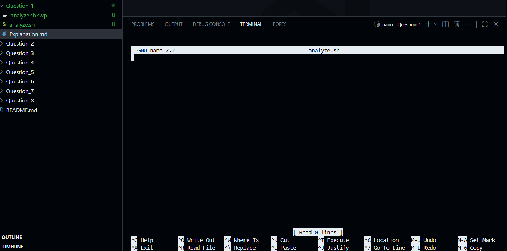
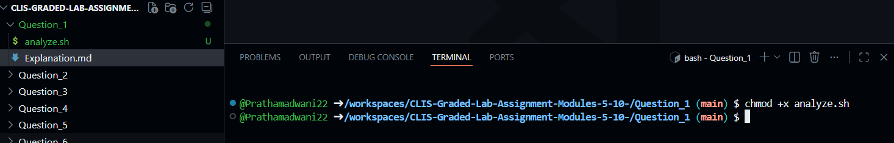
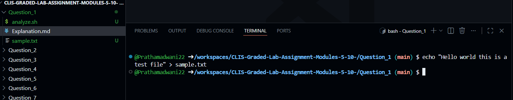
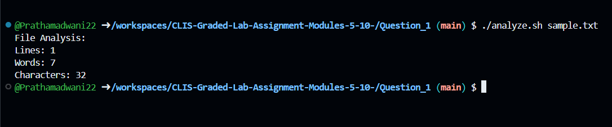
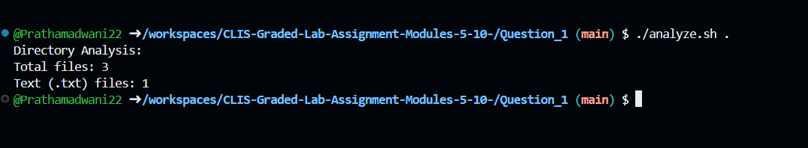
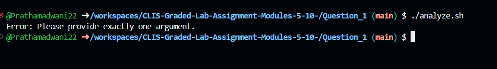
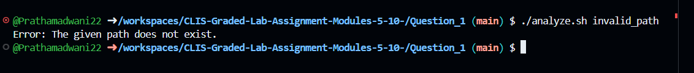

---

# Question 1

### 1. Creating the Shell Script File

### Shell Script Analysis (analyze.sh)
```bash
$ touch analyze.sh
```
- This command creates an empty shell script file named `analyze.sh` which will be used to implement the required logic.


---

### 2. Writing the Script Logic
```bash
$ nano analyze.sh
```
- This command opens the `analyze.sh` file in the nano editor to write the shell script logic.



---

### 3. Shell Script Implementation
```bash
#!/bin/bash

if [ "$#" -ne 1 ]; then
    echo "Error: Please provide exactly one argument."
    exit 1
fi

if [ ! -e "$1" ]; then
    echo "Error: The given path does not exist."
    exit 1
fi

if [ -f "$1" ]; then
    lines=$(wc -l < "$1")
    words=$(wc -w < "$1")
    chars=$(wc -c < "$1")

    echo "File Analysis:"
    echo "Lines: $lines"
    echo "Words: $words"
    echo "Characters: $chars"

elif [ -d "$1" ]; then
    total_files=$(find "$1" -type f | wc -l)
    txt_files=$(find "$1" -type f -name "*.txt" | wc -l)

    echo "Directory Analysis:"
    echo "Total files: $total_files"
    echo "Text (.txt) files: $txt_files"

else
    echo "Error: Invalid input."
fi
```
- The script validates the argument count, checks whether the path exists, and performs file or directory analysis accordingly.

---

### 4. Making the Script Executable
```bash
$ chmod +x analyze.sh
```
- This command grants execute permission to the shell script so it can be run directly from the terminal.



---

### 5. Creating a Sample File for Testing
```bash
$ echo "Hello world this is a test file" > sample.txt
```
- This command creates a sample text file to test the file analysis functionality of the script.


[sample.txt](sample.txt)
---

### 6. Executing Script with File Argument
```bash
$ ./analyze.sh sample.txt
```
- The script identifies the argument as a file and displays the number of lines, words, and characters present in it.


---

### 7. Executing Script with Directory Argument
```bash
$ ./analyze.sh .
```
- The script identifies the argument as a directory and displays the total number of files and the number of `.txt` files present.


---

### 8. Executing Script with No Arguments
```bash
$ ./analyze.sh
```
- Since no argument is provided, the script correctly displays an error message for invalid argument count.


---

### 9. Executing Script with Invalid Path
```bash
$ ./analyze.sh invalid_path
```
- The script detects that the provided path does not exist and displays an appropriate error message.



