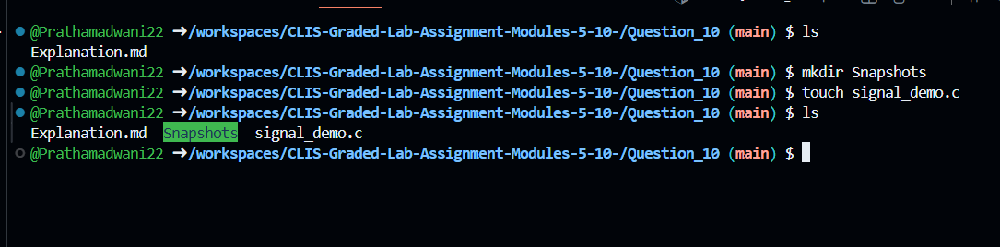
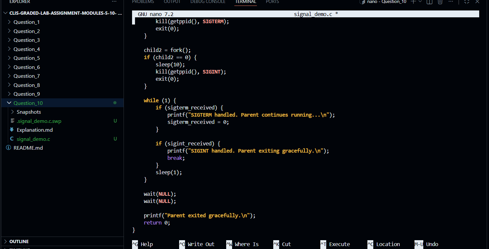
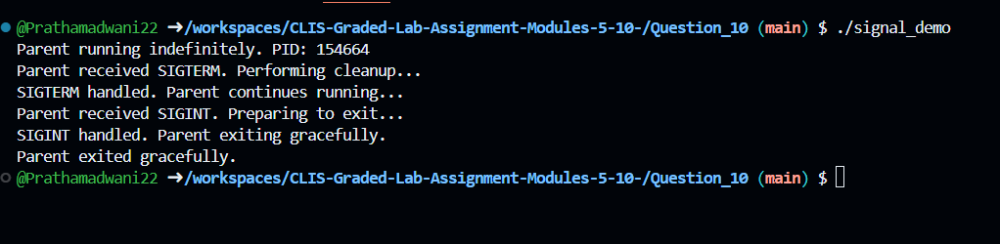

# Question 10

### Signal Handling in C Using Parent and Child Processes
---

### 1. Creating the Signal Handling C Program

$ touch signal_demo.c
- This command creates an empty C source file that will be used to demonstrate signal handling using multiple processes.


---

### 2. Writing the Program Logic

$ nano signal_demo.c
- This command opens the C source file to implement signal handlers in the parent process and child processes that send signals after fixed delays.


---

### 3. C Program Implementation
```c
#include <stdio.h>
#include <stdlib.h>
#include <unistd.h>
#include <signal.h>
#include <sys/wait.h>

volatile sig_atomic_t sigterm_received = 0;
volatile sig_atomic_t sigint_received = 0;

void handle_sigterm(int sig) {
    printf("Parent received SIGTERM. Performing cleanup...\n");
    sigterm_received = 1;
}

void handle_sigint(int sig) {
    printf("Parent received SIGINT. Preparing to exit...\n");
    sigint_received = 1;
}

int main() {
    pid_t child1, child2;

    // Register signal handlers
    signal(SIGTERM, handle_sigterm);
    signal(SIGINT, handle_sigint);

    printf("Parent running indefinitely. PID: %d\n", getpid());

    // First child sends SIGTERM after 5 seconds
    child1 = fork();
    if (child1 == 0) {
        sleep(5);
        kill(getppid(), SIGTERM);
        exit(0);
    }

    // Second child sends SIGINT after 10 seconds
    child2 = fork();
    if (child2 == 0) {
        sleep(10);
        kill(getppid(), SIGINT);
        exit(0);
    }

    // Parent loop
    while (1) {
        if (sigterm_received) {
            printf("SIGTERM handled. Parent continues running...\n");
            sigterm_received = 0;
        }

        if (sigint_received) {
            printf("SIGINT handled. Parent exiting gracefully.\n");
            break;
        }
        sleep(1);
    }

    // Clean up child processes
    wait(NULL);
    wait(NULL);

    printf("Parent exited gracefully.\n");
    return 0;
}
```


---

### 4. Compiling the Signal Handling Program

$ gcc signal_demo.c -o signal_demo
- This command compiles the C program implementing signal handling into an executable file.


---

### 5. Executing the Signal Handling Program

$ ./signal_demo
- This command runs the parent process indefinitely while child processes send SIGTERM and SIGINT signals after fixed delays.


---

### 6. Handling SIGTERM Signal

- After 5 seconds, the first child process sends a `SIGTERM` signal to the parent process.
- The parent process handles the signal by printing a message and continues execution without terminating.


---

### 7. Handling SIGINT Signal and Graceful Exit

- After 10 seconds, the second child process sends a `SIGINT` signal to the parent process.
- The parent process handles SIGINT differently and exits gracefully after cleaning up child processes.


