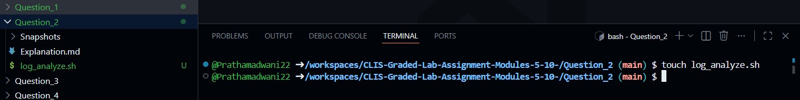
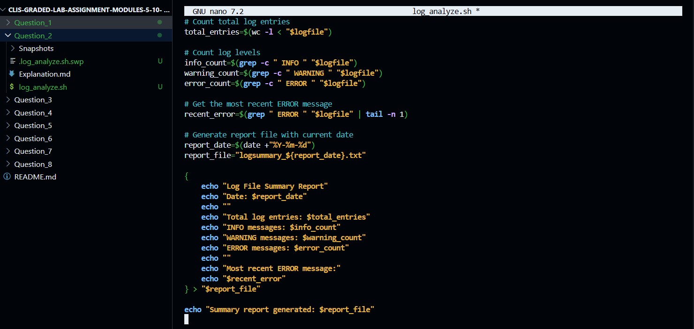
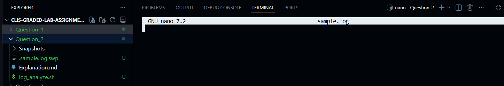
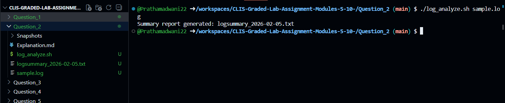
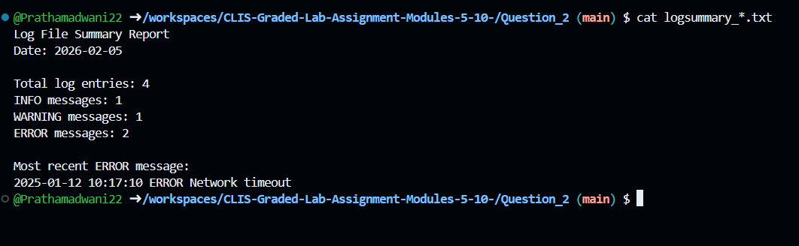
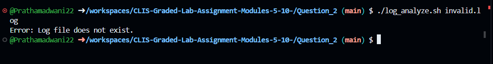

# Question 2

### Log File Analysis and Summary Generation
---

### 1. Creating the Log Analysis Script

$ touch log_analyze.sh
- This command creates an empty shell script file that will be used to analyze the log file and generate a summary report.

---

### 2. Writing the Script Logic

$ nano log_analyze.sh
- This command opens the `log_analyze.sh` file in the nano editor to write the logic for validating the log file, analyzing log entries, and generating a summary report.


---

### 3. Shell Script Implementation
```bash
#!/bin/bash

# Check if exactly one argument is provided
if [ "$#" -ne 1 ]; then
    echo "Error: Please provide exactly one log file as an argument."
    exit 1
fi

logfile="$1"

# Check if file exists and is readable
if [ ! -e "$logfile" ]; then
    echo "Error: Log file does not exist."
    exit 1
fi

if [ ! -r "$logfile" ]; then
    echo "Error: Log file is not readable."
    exit 1
fi

# Count total log entries
total_entries=$(wc -l < "$logfile")

# Count log levels
info_count=$(grep -c " INFO " "$logfile")
warning_count=$(grep -c " WARNING " "$logfile")
error_count=$(grep -c " ERROR " "$logfile")

# Get the most recent ERROR message
recent_error=$(grep " ERROR " "$logfile" | tail -n 1)

# Generate report file with current date
report_date=$(date +"%Y-%m-%d")
report_file="logsummary_${report_date}.txt"

{
    echo "Log File Summary Report"
    echo "Date: $report_date"
    echo ""
    echo "Total log entries: $total_entries"
    echo "INFO messages: $info_count"
    echo "WARNING messages: $warning_count"
    echo "ERROR messages: $error_count"
    echo ""
    echo "Most recent ERROR message:"
    echo "$recent_error"
} > "$report_file"

echo "Summary report generated: $report_file"
```
---

### 4. Making the Script Executable

$ chmod +x log_analyze.sh
- This command grants execute permission to the log analysis script so it can be run directly from the terminal.


---

### 5. Creating a Sample Log File for Testing

$ nano sample.log
- This command creates a sample log file containing entries with INFO, WARNING, and ERROR levels for testing the script.


[sample.log](sample.log)
---

### 6. Executing Script with Log File Argument

$ ./log_analyze.sh sample.log
- This command runs the script with the log file as input and displays log statistics while generating a summary report.


---

### 7. Viewing the Generated Summary Report

$ cat logsummary_<date>.txt
- This command displays the contents of the generated log summary report file to verify the analysis results.


---

### 8. Executing Script with No Arguments

$ ./log_analyze.sh
- Since no argument is provided, the script displays a meaningful error message indicating incorrect usage.


---

### 9. Executing Script with Invalid File Name

$ ./log_analyze.sh invalid.log
- This command tests the script with a non-existent log file, and the script displays an appropriate error message.



