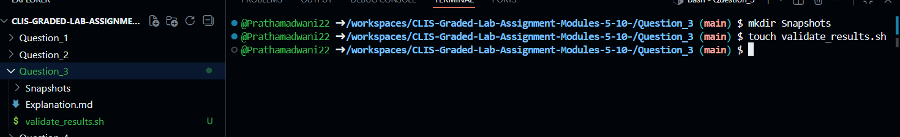
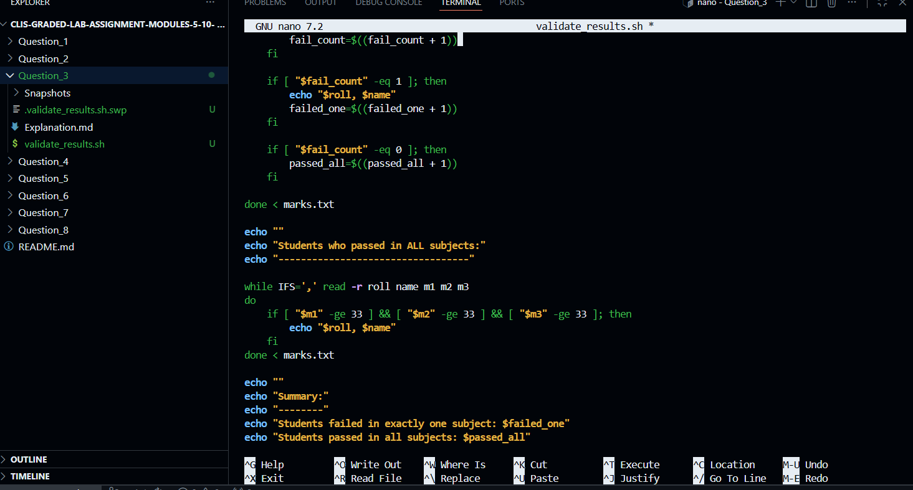
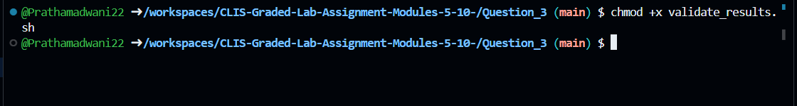
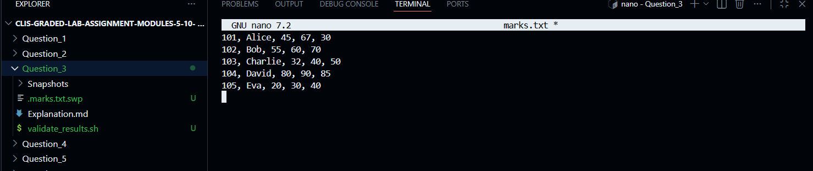
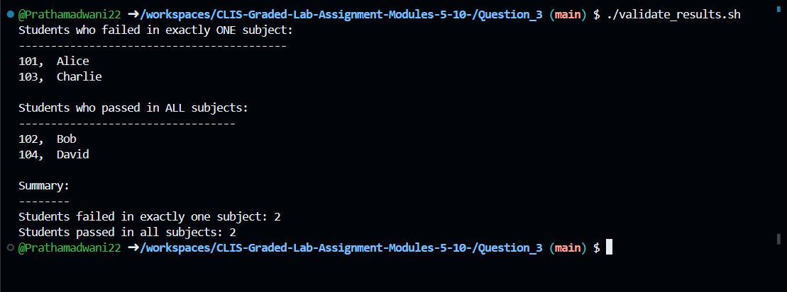

# Question 3

### Student Result Validation Using Shell Script
---

### 1. Creating the Result Validation Script

$ touch validate_results.sh
- This command creates an empty shell script file that will be used to validate student results based on marks.



- This command creates an empty shell script file that will be used to validate student results based on marks.


$ nano validate_results.sh
- This command opens the `validate_results.sh` file in the nano editor to write the logic for reading student marks, validating results, and categorizing students.


---

### 3. Shell Script Implementation
```bash
#!/bin/bash

# Check if marks file exists and is readable
if [ ! -r marks.txt ]; then
    echo "Error: marks.txt file not found or not readable."
    exit 1
fi

failed_one=0
passed_all=0

echo "Students who failed in exactly ONE subject:"
echo "------------------------------------------"

while IFS=',' read -r roll name m1 m2 m3
do
    fail_count=0

    if [ "$m1" -lt 33 ]; then
        fail_count=$((fail_count + 1))
    fi
    if [ "$m2" -lt 33 ]; then
        fail_count=$((fail_count + 1))
    fi
    if [ "$m3" -lt 33 ]; then
        fail_count=$((fail_count + 1))
    fi

    if [ "$fail_count" -eq 1 ]; then
        echo "$roll, $name"
        failed_one=$((failed_one + 1))
    fi

    if [ "$fail_count" -eq 0 ]; then
        passed_all=$((passed_all + 1))
    fi

done < marks.txt

echo ""
echo "Students who passed in ALL subjects:"
echo "----------------------------------"

while IFS=',' read -r roll name m1 m2 m3
do
    if [ "$m1" -ge 33 ] && [ "$m2" -ge 33 ] && [ "$m3" -ge 33 ]; then
        echo "$roll, $name"
    fi
done < marks.txt

echo ""
echo "Summary:"
echo "--------"
echo "Students failed in exactly one subject: $failed_one"
echo "Students passed in all subjects: $passed_all"
```
---

### 4. Making the Script Executable


$ chmod +x validate_results.sh
- This command grants execute permission to the result validation script so it can be run directly from the terminal.


---

### 5. Creating the Marks File for Testing

$ nano marks.txt
- This command creates a marks file containing student roll numbers, names, and marks for three subjects to test the script.


[marks.txt](marks.txt)
---

### 6. Executing the Result Validation Script

$ ./validate_results.sh
- This command runs the script, reads student data from `marks.txt`, displays students who failed in exactly one subject, students who passed all subjects, and prints the count for each category.


---

### 7. Handling Missing Marks File

$ rm marks.txt
$ ./validate_results.sh
- This command tests the script when the marks file is missing, and the script displays an appropriate error message.


