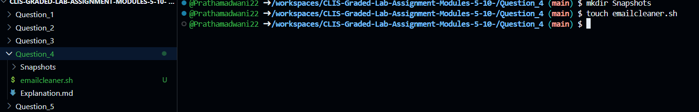
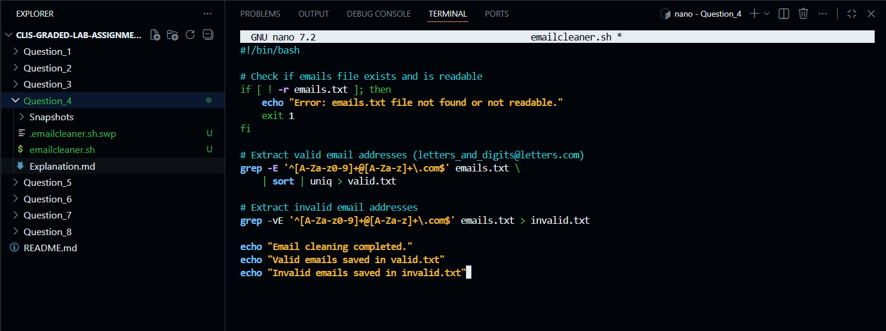
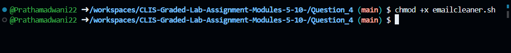
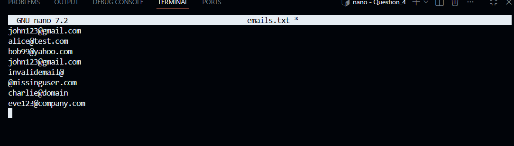
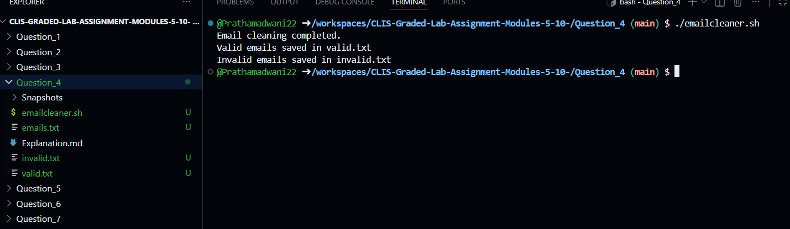
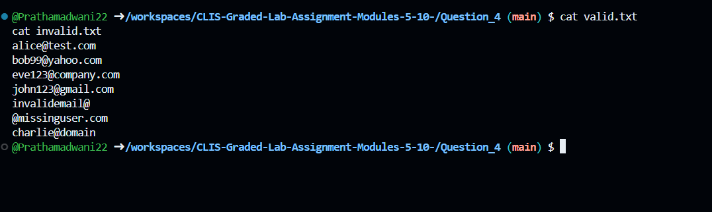
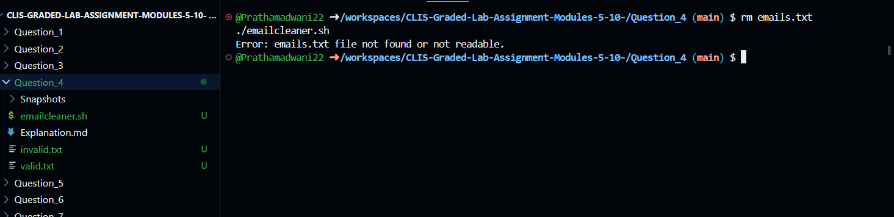

# Question 4

### Email Address Validation and Cleaning Using Shell Script
---

### 1. Creating the Email Cleaner Script

$ touch emailcleaner.sh
- This command creates an empty shell script file that will be used to extract and classify email addresses.


---

### 2. Writing the Script Logic

$ nano emailcleaner.sh
- This command opens the `emailcleaner.sh` file in the nano editor to write the logic for extracting valid and invalid email addresses.


---

### 3. Shell Script Implementation
```bash
#!/bin/bash

# Check if emails file exists and is readable
if [ ! -r emails.txt ]; then
    echo "Error: emails.txt file not found or not readable."
    exit 1
fi

# Extract valid email addresses (letters_and_digits@letters.com)
grep -E '^[A-Za-z0-9]+@[A-Za-z]+\.com$' emails.txt \
    | sort | uniq > valid.txt

# Extract invalid email addresses
grep -vE '^[A-Za-z0-9]+@[A-Za-z]+\.com$' emails.txt > invalid.txt

echo "Email cleaning completed."
echo "Valid emails saved in valid.txt"
echo "Invalid emails saved in invalid.txt"
```
---

### 4. Making the Script Executable


$ chmod +x emailcleaner.sh
- This command grants execute permission to the email cleaner script so it can be run directly from the terminal.


---

### 5. Creating the Emails File for Testing

$ nano emails.txt
- This command creates a file containing a mix of valid and invalid email addresses for testing the script.


[emails.txt](emails.txt)
---

### 6. Executing the Email Cleaner Script

$ ./emailcleaner.sh
- This command runs the script, extracts valid and invalid email addresses, removes duplicate valid entries, and stores the results in separate files.


---

### 7. Viewing the Generated Output Files

$ cat valid.txt
$ cat invalid.txt
- These commands display the contents of the files containing valid and invalid email addresses after processing.


---

### 8. Handling Missing Emails File

$ rm emails.txt
$ ./emailcleaner.sh
- This command tests the script behavior when the input file is missing, and the script displays an appropriate error message.



