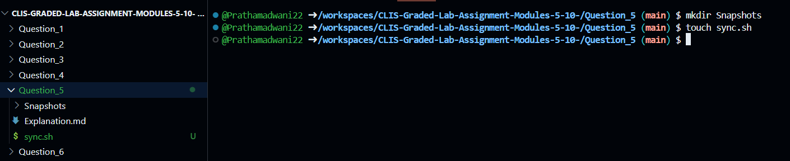
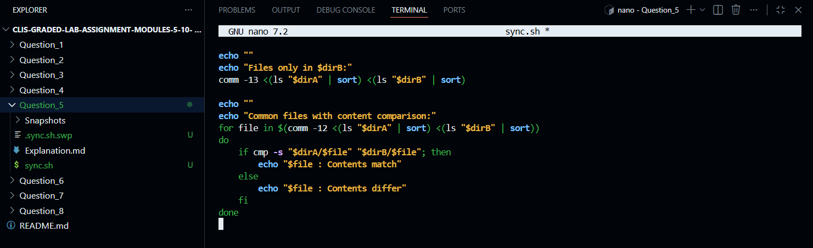
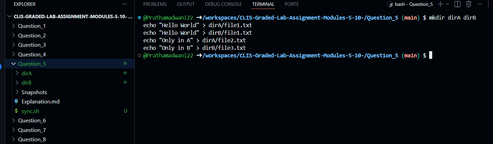
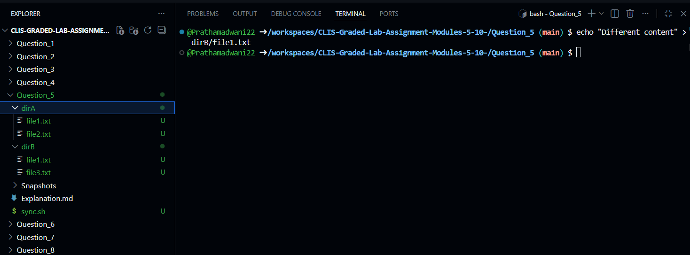
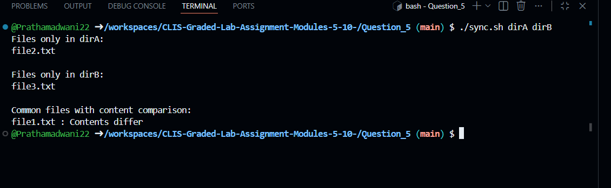
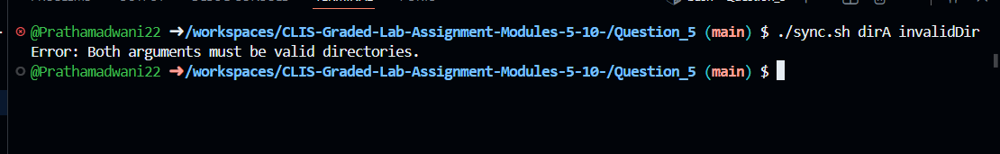

# Question 5

### Directory Comparison and Synchronization Check Using Shell Script
---

### 1. Creating the Directory Comparison Script
```bash
$ touch sync.sh
```
- This command creates an empty shell script file that will be used to compare the contents of two directories.


---

### 2. Writing the Script Logic
```bash
$ nano sync.sh
```
- This command opens the `sync.sh` file in the nano editor to write the logic for comparing files present in two directories without modifying them.


---

### 3. Shell Script Implementation
```bash
#!/bin/bash

# Check if exactly two arguments are provided
if [ "$#" -ne 2 ]; then
    echo "Usage: ./sync.sh <dirA> <dirB>"
    exit 1
fi

dirA="$1"
dirB="$2"

# Check if both directories exist
if [ ! -d "$dirA" ] || [ ! -d "$dirB" ]; then
    echo "Error: Both arguments must be valid directories."
    exit 1
fi

echo "Files only in $dirA:"
comm -23 <(ls "$dirA" | sort) <(ls "$dirB" | sort)

echo ""
echo "Files only in $dirB:"
comm -13 <(ls "$dirA" | sort) <(ls "$dirB" | sort)

echo ""
echo "Common files with content comparison:"
for file in $(comm -12 <(ls "$dirA" | sort) <(ls "$dirB" | sort))
do
    if cmp -s "$dirA/$file" "$dirB/$file"; then
        echo "$file : Contents match"
    else
        echo "$file : Contents differ"
    fi
done
```
---

### 4. Making the Script Executable
```bash
$ chmod +x sync.sh
```
- This command grants execute permission to the directory comparison script so it can be run directly from the terminal.


---

### 5. Creating Test Directories and Files
```bash
$ mkdir dirA dirB
$ echo "Hello World" > dirA/file1.txt
$ echo "Hello World" > dirB/file1.txt
$ echo "Only in A" > dirA/file2.txt
$ echo "Only in B" > dirB/file3.txt
```
- These commands create two test directories and populate them with files to demonstrate files unique to each directory and files with matching content.


---

### 6. Modifying a Common File to Test Differences
```bash
$ echo "Different content" > dirB/file1.txt
```
- This command modifies a common file in `dirB` to ensure the script detects content differences.


---

### 7. Executing the Directory Comparison Script
```bash
$ ./sync.sh dirA dirB
```
- This command runs the script, lists files unique to each directory, and compares contents of common files.


---

### 8. Handling Invalid Directory Arguments
```bash 
$ ./sync.sh dirA invalidDir
```
- This command tests the script behavior when an invalid directory is provided and displays an appropriate error message.



