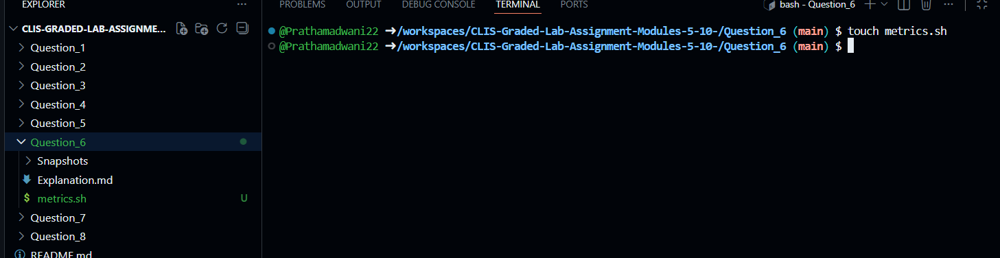
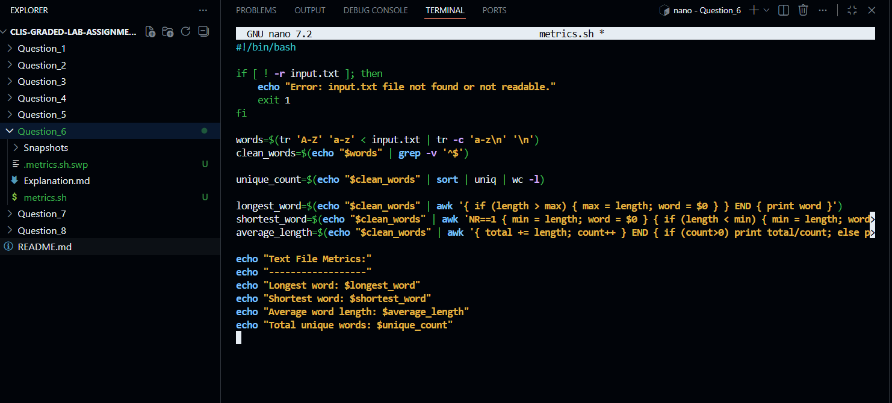
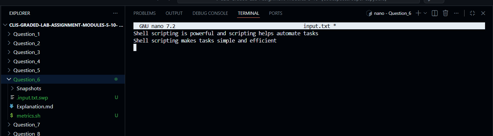
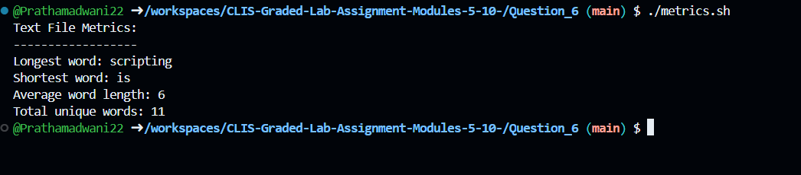
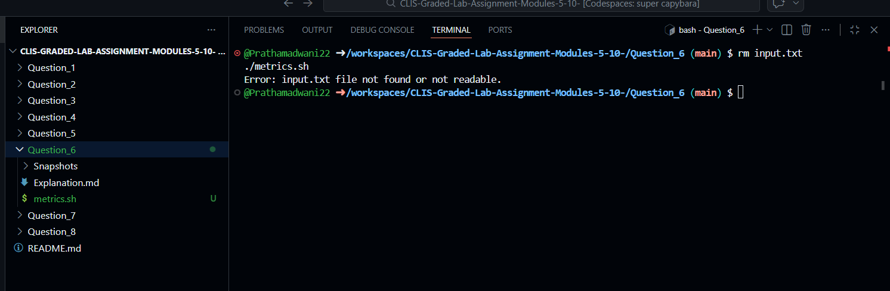

# Question 6

### Text File Metrics Analysis Using Shell Script
---

### 1. Creating the Text Metrics Script


- This command creates an empty shell script file that will be used to analyze word-level metrics from a text file.


---

### 2. Writing the Script Logic

$ nano metrics.sh
- This command opens the `metrics.sh` file in the nano editor to write the logic for analyzing word-level metrics from the input text file.


---

### 3. Shell Script Implementation
```bash
#!/bin/bash

# Check if input file exists and is readable
if [ ! -r input.txt ]; then
    echo "Error: input.txt file not found or not readable."
    exit 1
fi

# Convert text to lowercase, remove punctuation, and split into words
words=$(tr 'A-Z' 'a-z' < input.txt | tr -c 'a-z\n' '\n')

# Remove empty lines
clean_words=$(echo "$words" | grep -v '^$')

# Total unique words
unique_count=$(echo "$clean_words" | sort | uniq | wc -l)

# Longest word
longest_word=$(echo "$clean_words" | awk '{ if (length > max) { max = length; word = $0 } } END { print word }')

# Shortest word
shortest_word=$(echo "$clean_words" | awk 'NR==1 { min = length; word = $0 } { if (length < min) { min = length; word = $0 } } END { print word }')

# Average word length
average_length=$(echo "$clean_words" | awk '{ total += length; count++ } END { if (count > 0) print total / count; else print 0 }')

echo "Text File Metrics:"
echo "------------------"
echo "Longest word: $longest_word"
echo "Shortest word: $shortest_word"
echo "Average word length: $average_length"
echo "Total unique words: $unique_count"
```

---

### 4. Making the Script Executable

$ chmod +x metrics.sh
- This command grants execute permission to the text metrics analysis script so it can be run directly from the terminal.


---

### 5. Creating the Input Text File for Testing

$ nano input.txt
- This command creates a text file containing sample content to test the metrics script.


[input.txt](input.txt)
---

### 6. Executing the Metrics Script

$ ./metrics.sh
- This command runs the script and displays the longest word, shortest word, average word length, and total number of unique words.


---

### 7. Handling Missing Input File

$ rm input.txt
$ ./metrics.sh
- This command tests the script behavior when the input file is missing, and the script displays an appropriate error message.



