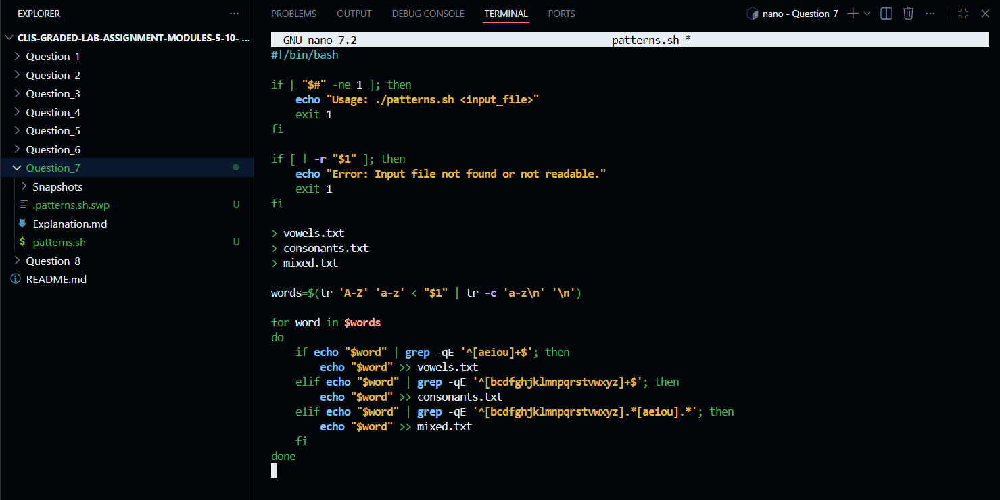
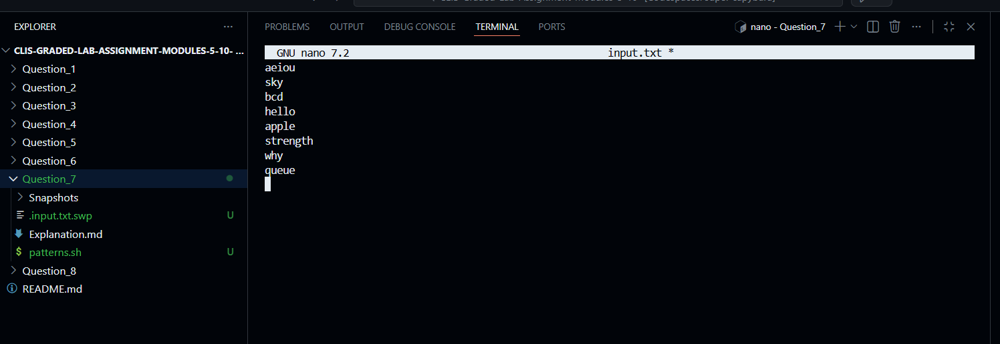
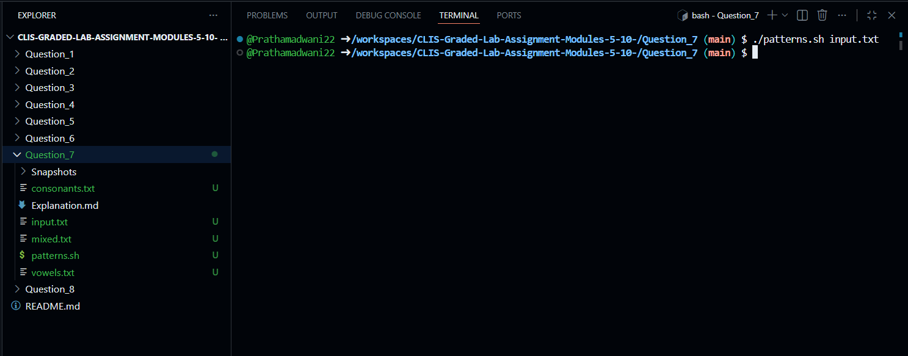
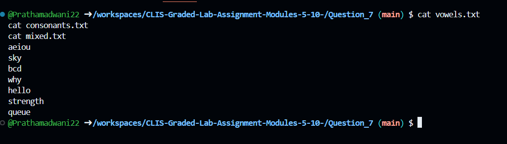
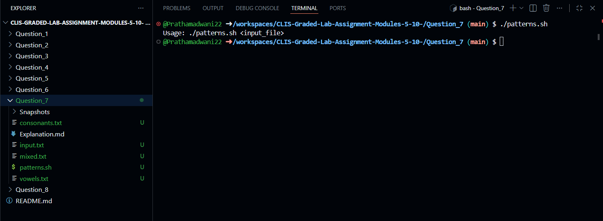

# Question 7

### Word Pattern Classification Using Shell Script
---

### 1. Creating the Pattern Classification Script
```bash
$ touch patterns.sh
```
- This command creates an empty shell script file that will be used to classify words based on vowel and consonant patterns.

---

### 2. Writing the Script Logic
```bash
$ nano patterns.sh
```
- This command opens the `patterns.sh` file in the nano editor to write the logic for classifying words based on vowel and consonant patterns.


---

### 3. Shell Script Implementation
```bash
#!/bin/bash

# Check if input file is provided and readable
if [ "$#" -ne 1 ]; then
    echo "Usage: ./patterns.sh <input_file>"
    exit 1
fi

if [ ! -r "$1" ]; then
    echo "Error: Input file not found or not readable."
    exit 1
fi

# Clear output files
> vowels.txt
> consonants.txt
> mixed.txt

# Convert text to lowercase and extract words
words=$(tr 'A-Z' 'a-z' < "$1" | tr -c 'a-z\n' '\n')

for word in $words
do
    # Only vowels
    if echo "$word" | grep -qE '^[aeiou]+$'; then
        echo "$word" >> vowels.txt

    # Only consonants
    elif echo "$word" | grep -qE '^[bcdfghjklmnpqrstvwxyz]+$'; then
        echo "$word" >> consonants.txt

    # Mixed but starting with a consonant
    elif echo "$word" | grep -qE '^[bcdfghjklmnpqrstvwxyz].*[aeiou].*'; then
        echo "$word" >> mixed.txt
    fi
done
```


---

### 4. Making the Script Executable
```bash
$ chmod +x patterns.sh
```
- This command grants execute permission to the pattern classification script so it can be run directly from the terminal.


---

### 5. Creating the Input Text File for Testing
```bash
$ nano input.txt
```
- This command creates a text file containing words with different vowel and consonant patterns for testing the script.


[input.txt](input.txt)
---

### 6. Executing the Pattern Classification Script
```bash
$ ./patterns.sh input.txt
```
- This command runs the script and classifies words into vowel-only, consonant-only, and mixed categories.


---

### 7. Viewing the Generated Output Files
```bash
$ cat vowels.txt
$ cat consonants.txt
$ cat mixed.txt
```
- These commands display the contents of the files containing vowel-only words, consonant-only words, and mixed words starting with a consonant.


---

### 8. Handling Missing Input File Argument
```bash
$ ./patterns.sh
```
- This command tests the script behavior when no input file is provided and displays an appropriate error message.



