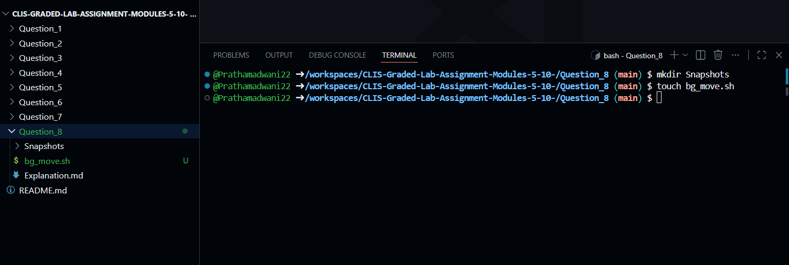
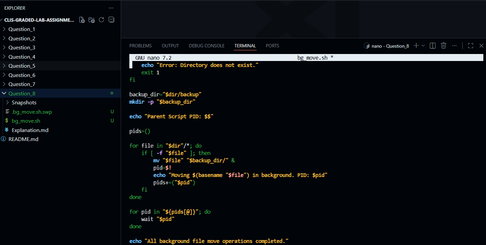
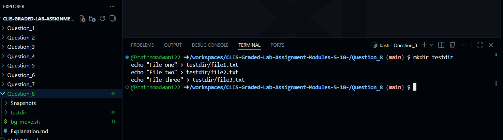
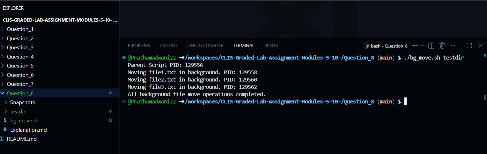
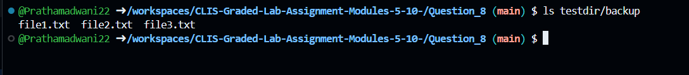

# Question 8

### Background File Movement Using Shell Script
---

### 1. Creating the Background Move Script

$ touch bg_move.sh
- This command creates an empty shell script file that will be used to move files into a backup directory using background processes.


---

### 2. Writing the Script Logic

$ nano bg_move.sh
- This command opens the `bg_move.sh` file in the nano editor to write the logic for moving files in the background and tracking their process IDs.


---

### 3. Shell Script Implementation
```bash
#!/bin/bash

# Check if exactly one argument is provided
if [ "$#" -ne 1 ]; then
    echo "Usage: ./bg_move.sh <directory_path>"
    exit 1
fi

dir="$1"

# Check if directory exists
if [ ! -d "$dir" ]; then
    echo "Error: Directory does not exist."
    exit 1
fi

# Create backup directory if it doesn't exist
backup_dir="$dir/backup"
mkdir -p "$backup_dir"

echo "Parent Script PID: $$"

pids=()

# Move each file in background
for file in "$dir"/*; do
    if [ -f "$file" ]; then
        mv "$file" "$backup_dir/" &
        pid=$!
        echo "Moving $(basename "$file") in background. PID: $pid"
        pids+=("$pid")
    fi
done

# Wait for all background processes
for pid in "${pids[@]}"; do
    wait "$pid"
done

echo "All background file move operations completed."
```


---

### 4. Making the Script Executable

$ chmod +x bg_move.sh
- This command grants execute permission to the background file movement script so it can be run directly from the terminal.


---

### 5. Creating Test Directory and Files

$ mkdir testdir
$ echo "File one" > testdir/file1.txt
$ echo "File two" > testdir/file2.txt
$ echo "File three" > testdir/file3.txt
- These commands create a test directory containing multiple files to demonstrate background move operations.


---

### 6. Executing the Background Move Script

$ ./bg_move.sh testdir
- This command runs the script, moves files into the backup directory in the background, displays the PID of each background process, and waits for all processes to complete.


---

### 7. Verifying Backup Directory Contents

$ ls testdir/backup
- This command verifies that all files have been successfully moved into the backup directory.


---

### 8. Handling Invalid Directory Argument

$ ./bg_move.sh invalidDir
- This command tests the script behavior when an invalid directory is provided and displays an appropriate error message.


