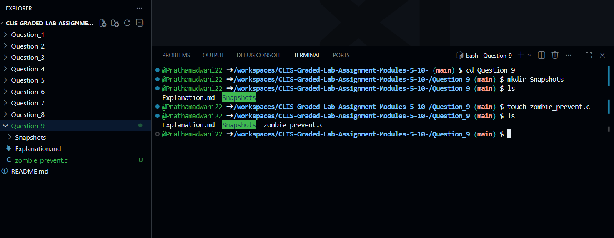
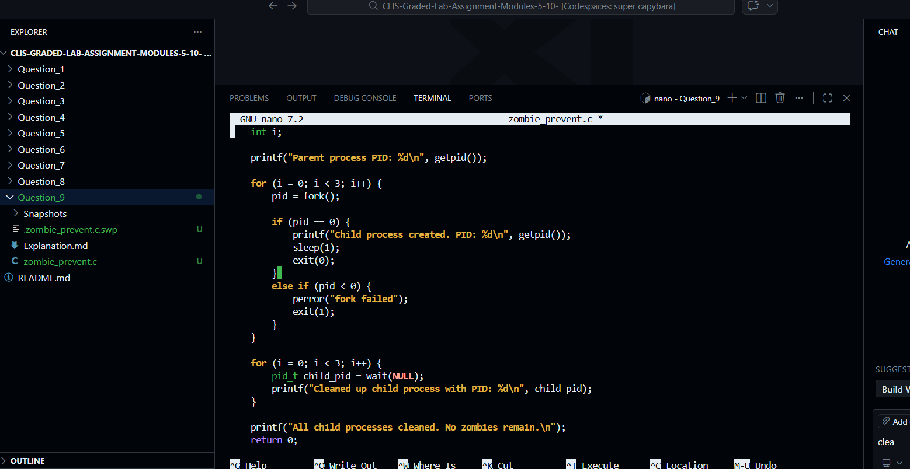
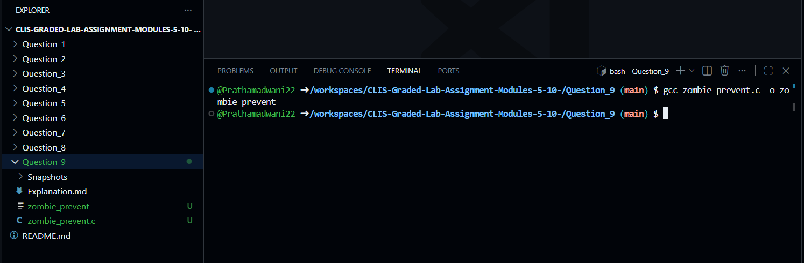
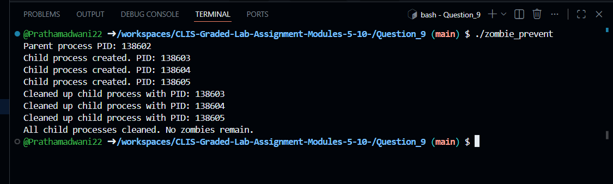
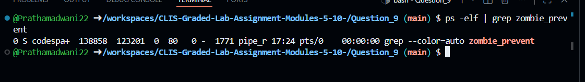

# Question 9

### Zombie Process Prevention Using C Program
---

### 1. Creating the C Program File
```bash
$ touch zombie_prevent.c
```
- This command creates an empty C source file that will be used to demonstrate prevention of zombie processes using process control system calls.


---

### 2. Writing the Program Logic
```bash
$ nano zombie_prevent.c
```
- This command opens the C source file in the nano editor to write logic for creating child processes and preventing zombie processes using `wait()`.


---

### 3. C Program Implementation
```c
#include <stdio.h>
#include <stdlib.h>
#include <unistd.h>
#include <sys/wait.h>

int main() {
    int i;
    pid_t pid;

    printf("Parent process PID: %d\n", getpid());

    for (i = 0; i < 3; i++) {
        pid = fork();

        if (pid == 0) {
            // Child process
            printf("Child process created. PID: %d\n", getpid());
            sleep(1);
            exit(0);
        } 
        else if (pid < 0) {
            perror("fork failed");
            exit(1);
        }
    }

    // Parent waits for all child processes
    for (i = 0; i < 3; i++) {
        pid_t child_pid = wait(NULL);
        printf("Cleaned up child process with PID: %d\n", child_pid);
    }

    printf("All child processes cleaned. No zombies remain.\n");
    return 0;
}
```


---

### 4. Compiling the C Program
```bash
$ gcc zombie_prevent.c -o zombie_prevent
```
- This command compiles the C source file into an executable named `zombie_prevent`.


---

### 5. Executing the Program
```bash
$ ./zombie_prevent
```
- This command runs the program, creates multiple child processes, and shows the parent process cleaning up each child process by printing their PIDs.


---

### 6. Verifying Zombie Process Prevention
```bash
$ ps -elf | grep zombie_prevent
```
- This command verifies that no zombie processes remain after execution of the program.


---

### 7. Handling Process Creation Errors
```bash
$ ./zombie_prevent
```
- This step confirms that even if process creation fails, the program safely exits without leaving zombie processes.


